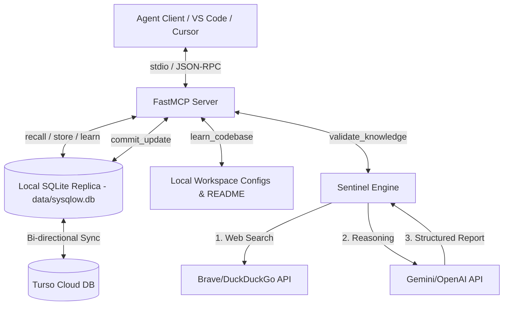

# System Query Flow (SysQlow-MCP)

[](https://modelcontextprotocol.io/)
[](https://bun.sh/)
[](https://turso.tech/)
[](https://www.docker.com/)

**System Query Flow (SysQlow-MCP)** is an intelligent, self-validating local-first engineering knowledge base built on top of the **Model Context Protocol (MCP)**. It acts as a "closed-loop" memory system designed to store technical snippets, automatically scan and learn codebase architectures, validate stored insights against live documentation in real-time, and expose tools for AI agents (like Cursor, VS Code, and Claude) to retrieve, refine, and update developer knowledge.

---

## 🛠️ Architecture Stack & Features

- **Project Metadata Scanning:** Direct local file system scanning detects core technology stacks, specific framework versions, and project architecture signature configuration files (e.g., `package.json`, `composer.json`, `Cargo.toml`, etc.).
- **Local-First Embedded Replica (Turso):** Microsecond read latencies on your local Mac using a local SQLite replica (`data/sysqlow.db`), automatically pushing database writes and schema creations up to the **Turso Cloud** primary.
- **Robust Wildcard Search Index:** Equipped with a dual-transport search engine. If a client LLM requests a broad scan (`*`), the engine gracefully intercepts the query to list all items; specific keyword queries use an integrated **FTS5 (Full-Text Search)** virtual index or fall back to SQL `LIKE` patterns.
- **The "Sentinel" Validation Engine:** Connects to the **Google Gemini API** (or OpenAI) to verify the accuracy of technical notes against modern documentation retrieved via Brave Search or keyless DuckDuckGo fetching.
- **Lookbehind JSON Repair Engine:** A custom-built, regex-driven parser (`/(?<!\\)\\(?!["\\/bfnrtu])/g`) automatically sanitizes double-backslashes in LLM JSON responses (such as PHP namespaces `Illuminate\Support`), guaranteeing robust serialization.



---

## 🔌 MCP Tools Specification & Usage Guides

SysQlow-MCP exposes five highly optimized, Zod-validated tools. 

---

### 1. `learn_codebase`
Scans your active project directory, auto-detects the technology stack and core dependency versions, summarizes the overall architectural guidelines, and stores them in your knowledge base as project context.

* **Parameters:**
  * `projectPath` (string, optional): Absolute path to the project root directory. If omitted, defaults to the current working directory of the server.
* **How to use it:**
  Ask your IDE's assistant:
  > *"Use the `learn_codebase` tool to analyze my current project stack."*
* **What it returns:**
  ```markdown
  ## 🧠 Successfully Learned Project: "my-laravel-app"
  Discovered and analyzed key metadata from: package.json, composer.json, README.md
  Stored **3** project-specific context snippets in the database.

  ---
  ### [1] Topic: my-laravel-app: Tech Stack & Dependencies
  Category: Project Context
  Content: Discovered Laravel 11.x framework using Bun runtime for frontend compiling...
  ```

---

### 2. `store_knowledge`
Persists a new technical snippet, code block, configuration, or command directly into your database.

* **Parameters:**
  * `topic` (string, required): The subject of the knowledge (e.g., `"Laravel 11 Rate Limiting"`).
  * `content` (string, required): The actual technical snippet, config, or terminal command.
  * `category` (string, optional): Folder/category name (e.g., `"Backend"`, `"Frontend"`, `"DevOps"`).
* **How to use it:**
  Ask your IDE's assistant:
  > *"Store a technical snippet about Laravel 11 Rate Limiting under category 'Backend'. Use RateLimiter::for() inside bootstrap/app.php..."*
* **What it returns:**
  ```json
  {
    "status": "success",
    "message": "Technical snippet stored successfully.",
    "id": "7f9b1c90-2da8-4e12-b0c8-472251a3fb80",
    "topic": "Laravel 11 Rate Limiting",
    "category": "Backend"
  }
  ```

---

### 3. `recall_knowledge`
Searches your knowledge base to retrieve technical snippets using keyword matching or a broad list-all query.

* **Parameters:**
  * `query` (string, required): The term to search for. Pass `"*"` or leave blank to retrieve all stored records.
  * `category` (string, optional): Filter results by category.
* **How to use it:**
  Ask your IDE's assistant:
  > *"Recall all Laravel snippets from the database"* (sends `"query": "*"`)
  > *"Search my knowledge base for 'rate limit'"* (sends `"query": "rate limit"`)
* **What it returns:**
  ```markdown
  --- Result [1] ---
  ID: 7f9b1c90-2da8-4e12-b0c8-472251a3fb80
  Topic: Laravel 11 Rate Limiting
  Category: Backend
  Validated: Yes
  Confidence Score: 10/10
  Source URL: https://laravel.com/docs/11.x/rate-limiting

  Content:
  use Illuminate\Cache\RateLimiting\Limit;
  use Illuminate\Support\Facades\RateLimiter;
  ...
  ```

---

### 4. `validate_knowledge`
Triggers the **Sentinel validation engine** to audit a stored snippet's accuracy. It searches live documentation and compares it to your saved code, returning a validation status, a detailed reason, and a suggested code diff. **It is read-only and never auto-writes to the database for safety.**

* **Parameters:**
  * `id` (string, required): The UUID of the snippet to validate.
* **How to use it:**
  Ask your IDE's assistant:
  > *"Audit the snippet with ID '7f9b1c90-2da8-4e12-b0c8-472251a3fb80' against the latest web documentation."*
* **What it returns:**
  ```json
  {
    "id": "7f9b1c90-2da8-4e12-b0c8-472251a3fb80",
    "status": "needs_update",
    "confidence_score": 5,
    "source_url": "https://laravel.com/docs/11.x/rate-limiting",
    "reasoning": "The stored snippet uses Laravel 9's RouteServiceProvider to configure rate limits. In Laravel 11, RouteServiceProvider is removed, and rate limiters must be defined inside bootstrap/app.php.",
    "suggested_diff": "--- old_snippet\n+++ new_snippet\n..."
  }
  ```

---

### 5. `commit_update`
Saves an approved update to a stored snippet. This is the **Human-in-the-loop** completion step. Once you review and approve the suggested diff from `validate_knowledge`, this tool persists it and marks the snippet as validated.

* **Parameters:**
  * `id` (string, required): The UUID of the snippet to update.
  * `content` (string, required): The new, refined snippet content.
* **How to use it:**
  Ask your IDE's assistant:
  > *"The validation report looks correct. Commit the suggested diff for snippet '7f9b1c90-2da8-4e12-b0c8-472251a3fb80'."*
* **What it returns:**
  ```json
  {
    "status": "success",
    "message": "Snippet \"Laravel 11 Rate Limiting\" has been successfully updated and marked as validated.",
    "id": "7f9b1c90-2da8-4e12-b0c8-472251a3fb80"
  }
  ```

---

## ⚙️ Setup & Configuration

### Prerequisites
- [Bun](https://bun.sh/) (v1.2+) installed on your machine.
- A **Turso** database and auth token.
- A **Google Gemini** API key to enable Sentinel validations.

### 1. Environment Configuration
Create a `.env` file in the root of the project:
```ini
TURSO_DATABASE_URL="libsql://your-db-url.turso.io"
TURSO_AUTH_TOKEN="your-turso-jwt-token"
GEMINI_API_KEY="AIzaSy..." # Enables validation reasoning
BRAVE_API_KEY="your-brave-key" # Optional (falls back to DDG scraper)
```

---

## 🐳 Running with Docker (Persistent Setup)

We provide an automated pipeline that runs the server in SSE transport mode, exposing a network port to communicate with Cursor or VS Code.

### Run in One Command:
Simply execute the included bash script to clean, rebuild, and start the container:
```bash
./run-docker.sh --sse
```

This binds port `32768` on your local machine to the SSE transport inside the container, directing database replica files securely to the mounted `data/` directory.

---

## 📦 Bundling & Native Compilation

You can compile SysQlow-MCP into a **single standalone native executable binary** that requires no Node or Bun runtimes on the host machine:

```bash
# Natively compile into dist/sysqlow-mcp
bun run compile
```

## 🖥️ IDE Integration Configurations

To integrate **System Query Flow** as a developer companion in your workspace:

### 1. Antigravity-IDE Integration (SSE / URL Mode)
1. Ensure the Docker container is running in SSE mode: `./run-docker.sh --sse`.
2. Open **Manage MCP servers** in Antigravity-IDE, click **"View raw config"**, and add:
   ```json
   "sysqlow-mcp": {
     "serverURL": "http://localhost:32768/sse"
   }
   ```
   > [!NOTE]
   > The `"serverURL"` key is specific to **Antigravity-IDE**'s raw configuration format to register SSE network endpoints.

### 2. Other IDEs (Cursor, Windsurf, Claude Desktop, etc.)
* For Cursor, Claude Desktop, Windsurf, or other environments, the setup procedure varies depending on the platform's support for Stdio or SSE.
* Please refer directly to the **official documentation of your respective IDE/Client** for correct setup instructions.

#### Example Stdio Configuration (Native Binary)
For clients that launch standard input/output (stdio) commands (such as Claude Desktop or general VS Code extensions), you can call the compiled native binary:
```json
{
  "mcpServers": {
    "sysqlow-mcp": {
      "command": "/Users/barayuda/Projects/personal/sysqlow-mcp/dist/sysqlow-mcp",
      "env": {
        "TURSO_DATABASE_URL": "libsql://your-db-url.turso.io",
        "TURSO_AUTH_TOKEN": "your-turso-jwt-token",
        "GEMINI_API_KEY": "<your-gemini-key>",
        "BRAVE_API_KEY": "<optional-brave-key>"
      }
    }
  }
}
```
