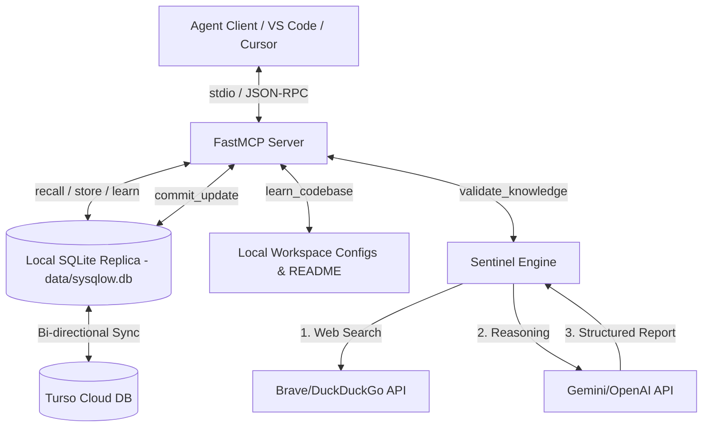
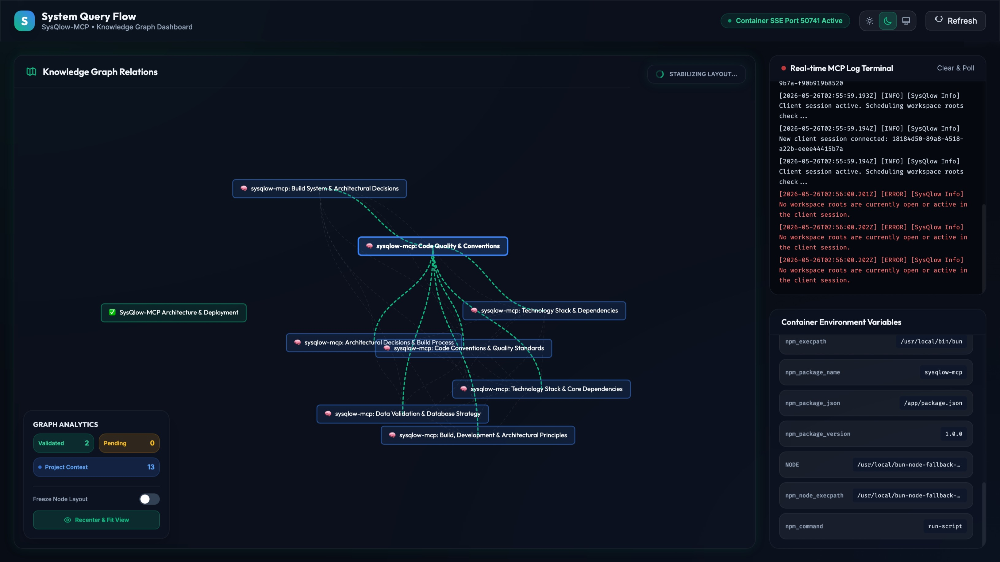

# System Query Flow (SysQlow-MCP)

[](https://modelcontextprotocol.io/)
[](https://bun.sh/)
[](https://turso.tech/)
[](https://www.docker.com/)
[](#)
[](https://github.com/barayuda/sysqlow-mcp/actions/workflows/coverage.yml)

**System Query Flow (SysQlow)** is an intelligent, self-validating local-first engineering knowledge base MCP server. It features microsecond Turso Embedded Replica sync, automatic codebase stack & convention learning, and a Gemini-powered Sentinel validation engine to audit snippets against live web documentation in real-time.

---

## 🛠️ Architecture Stack & Features

- **Project Metadata Scanning:** Direct local file system scanning detects core technology stacks, specific framework versions, and project architecture signature configuration files (e.g., `package.json`, `composer.json`, `Cargo.toml`, etc.).
- **Local-First Embedded Replica (Turso):** Microsecond read latencies on your local Mac using a local SQLite replica (`data/sysqlow.db`), automatically pushing database writes and schema creations up to the **Turso Cloud** primary.
- **Robust Wildcard Search Index:** Equipped with a dual-transport search engine. If a client LLM requests a broad scan (`*`), the engine gracefully intercepts the query to list all items; specific keyword queries use an integrated **FTS5 (Full-Text Search)** virtual index or fall back to SQL `LIKE` patterns.
- **The "Sentinel" Validation Engine:** Connects to the **Google Gemini API** (or OpenAI) to verify the accuracy of technical notes against modern documentation retrieved via Brave Search or keyless DuckDuckGo fetching.
- **Lookbehind JSON Repair Engine:** A custom-built, regex-driven parser (`/(?<!\\)\\(?!["\\/bfnrtu])/g`) automatically sanitizes double-backslashes in LLM JSON responses (such as PHP namespaces `Illuminate\Support`), guaranteeing robust serialization.



---

## 🔌 MCP Tools Specification & Usage Guides

SysQlow-MCP exposes 11 highly optimized, Zod-validated tools. 

---

### 1. `learn_codebase`
Scans your active project directory, auto-detects the technology stack and core dependency versions, summarizes the overall architectural guidelines, and stores them in your knowledge base as project context.

* **Parameters:**
  * `projectPath` (string, optional): Absolute path to the project root directory. If omitted, defaults to the current working directory of the server.
* **How to use it:**
  Ask your IDE's assistant:
  > *"Use the `learn_codebase` tool to analyze my current project stack."*
* **What it returns:**
  ```markdown
  ## 🧠 Successfully Learned Project: "my-laravel-app"
  Discovered and analyzed key metadata from: package.json, composer.json, README.md
  Stored **3** project-specific context snippets in the database.

  ---
  ### [1] Topic: my-laravel-app: Tech Stack & Dependencies
  Category: Project Context
  Content: Discovered Laravel 11.x framework using Bun runtime for frontend compiling...
  ```

---

### 2. `store_knowledge`
Persists a new technical snippet, code block, configuration, or command directly into your database.

* **Parameters:**
  * `topic` (string, required): The subject of the knowledge (e.g., `"Laravel 11 Rate Limiting"`).
  * `content` (string, required): The actual technical snippet, config, or terminal command.
  * `category` (string, optional): Folder/category name (e.g., `"Backend"`, `"Frontend"`, `"DevOps"`).
* **How to use it:**
  Ask your IDE's assistant:
  > *"Store a technical snippet about Laravel 11 Rate Limiting under category 'Backend'. Use RateLimiter::for() inside bootstrap/app.php..."*
* **What it returns:**
  ```json
  {
    "status": "success",
    "message": "Technical snippet stored successfully.",
    "id": "7f9b1c90-2da8-4e12-b0c8-472251a3fb80",
    "topic": "Laravel 11 Rate Limiting",
    "category": "Backend"
  }
  ```

---

### 3. `recall_knowledge`
Searches your knowledge base to retrieve technical snippets using keyword matching or a broad list-all query.

* **Parameters:**
  * `query` (string, required): The term to search for. Pass `"*"` or leave blank to retrieve all stored records.
  * `category` (string, optional): Filter results by category.
* **How to use it:**
  Ask your IDE's assistant:
  > *"Recall all Laravel snippets from the database"* (sends `"query": "*"`)
  > *"Search my knowledge base for 'rate limit'"* (sends `"query": "rate limit"`)
* **What it returns:**
  ```markdown
  --- Result [1] ---
  ID: 7f9b1c90-2da8-4e12-b0c8-472251a3fb80
  Topic: Laravel 11 Rate Limiting
  Category: Backend
  Validated: Yes
  Confidence Score: 10/10
  Source URL: https://laravel.com/docs/11.x/rate-limiting

  Content:
  use Illuminate\Cache\RateLimiting\Limit;
  use Illuminate\Support\Facades\RateLimiter;
  ...
  ```

---

### 4. `validate_knowledge`
Triggers the **Sentinel validation engine** to audit a stored snippet's accuracy. It searches live documentation and compares it to your saved code, returning a validation status, a detailed reason, and a suggested code diff. **It is read-only and never auto-writes to the database for safety.**

* **Parameters:**
  * `id` (string, required): The UUID of the snippet to validate.
* **How to use it:**
  Ask your IDE's assistant:
  > *"Audit the snippet with ID '7f9b1c90-2da8-4e12-b0c8-472251a3fb80' against the latest web documentation."*
* **What it returns:**
  ```json
  {
    "id": "7f9b1c90-2da8-4e12-b0c8-472251a3fb80",
    "status": "needs_update",
    "confidence_score": 5,
    "source_url": "https://laravel.com/docs/11.x/rate-limiting",
    "reasoning": "The stored snippet uses Laravel 9's RouteServiceProvider to configure rate limits. In Laravel 11, RouteServiceProvider is removed, and rate limiters must be defined inside bootstrap/app.php.",
    "suggested_diff": "--- old_snippet\n+++ new_snippet\n..."
  }
  ```

---

### 5. `commit_update`
Saves an approved update to a stored snippet. This is the **Human-in-the-loop** completion step. Once you review and approve the suggested diff from `validate_knowledge`, this tool persists it and marks the snippet as validated.

* **Parameters:**
  * `id` (string, required): The UUID of the snippet to update.
  * `content` (string, required): The new, refined snippet content.
  * `revalidateBeforeCommit` (boolean, optional): Defaults to `true`. Runs validation again before writing the update.
* **How to use it:**
  Ask your IDE's assistant:
  > *"The validation report looks correct. Commit the suggested diff for snippet '7f9b1c90-2da8-4e12-b0c8-472251a3fb80'."*
* **What it returns:**
  ```json
  {
    "status": "success",
    "message": "Snippet \"Laravel 11 Rate Limiting\" has been successfully updated and marked as validated.",
    "id": "7f9b1c90-2da8-4e12-b0c8-472251a3fb80"
  }
  ```

---

### 6. `knowledge_workflow`
High-level orchestration tool for intent-first prompting. It helps clients auto-route requests without always mentioning specific tool names.

* **Parameters:**
  * `intent` (enum, required): `learn` | `save` | `search` | `validate` | `apply` | `delete` | `merge` | `semantic` | `import`
  * `projectPath` (string, optional): Used by `learn`
  * `topic`, `content`, `category` (optional fields): Used by `save`
  * `query`, `category` (optional fields): Used by `search` or `semantic`
  * `id` (string, optional): Used by `validate`, `apply`, or `delete`
  * `content` (string, optional): Used by `apply`
  * `revalidateBeforeCommit` (boolean, optional): Used by `apply` (default `true`)
  * `parentId`, `childId`, `mode` (optional fields): Used by `merge`
  * `url` (string, optional): Used by `import`
* **How to use it:**
  Ask your IDE assistant with intent language:
  > *"Analyze this workspace and store project context."*
  > *"Save this snippet under Backend."*
  > *"Search my knowledge base for rate limiting."*
  > *"Semantic search my cache options in category Backend."*
  > *"Scrape and import documentation from https://example.com/docs..."*
  > *"Link snippet child-id as a subtopic under parent-id..."*

---

### 7. `semantic_search`
Performs conceptual, high-fidelity vector similarity search on stored knowledge snippets using cosine similarity calculations.

* **Parameters:**
  * `query` (string, required): The search term or concept to query (e.g. `"caching databases"`).
  * `category` (string, optional): Optional category filter.
  * `limit` (number, optional): Max number of matches to return (default 5).
* **Graceful Degradation:** If Gemini embedding API limits are exhausted, the tool automatically degrades gracefully into FTS5 keyword indexing or standard SQL `LIKE` lookups.

---

### 8. `import_documentation`
Scrapes external HTML documentation, converts the sanitized text stream into a structured Markdown snippet using Gemini, and saves it in the database.

* **Parameters:**
  * `url` (string, required): The URL of the technical documentation to scrape and import.
  * `category` (string, optional): Category to store the snippet under (defaults to `"Backend"`).

---

## ✍️ Prompt Aliases And Ready Prompt Pack

Use intent-style prompts so your assistant can trigger SysQlow automatically even when you do not mention the server name.

### Prompt aliases (recommended verbs)
- **Analyze** = `learn_codebase` / `knowledge_workflow(intent=learn)`
- **Save** = `store_knowledge` / `knowledge_workflow(intent=save)`
- **Search / Find** = `recall_knowledge` / `knowledge_workflow(intent=search)`
- **Audit / Validate** = `validate_knowledge` / `knowledge_workflow(intent=validate)`
- **Apply** = `commit_update` / `knowledge_workflow(intent=apply)`

### Copy-paste prompt pack
1. Analyze my current workspace and save project context for later answers.
2. Save this technical note. Topic: <topic>. Category: <category>. Content: <content>.
3. Find my stored notes about <keyword> in category <category>.
4. Audit snippet ID <id> against current official documentation.
5. Apply this approved update to snippet ID <id> with content: <content>.

### Category discipline
For better recall consistency, categories are normalized to canonical names:
- Backend
- Frontend
- DevOps
- Project Context
- Database
- Testing
- Tooling

### Safe update discipline
`commit_update` now defaults to `revalidateBeforeCommit=true`, so updates are validated again before final write.

---

## ⚙️ Setup & Configuration

### Prerequisites
- [Bun](https://bun.sh/) (v1.2+) installed on your machine.
- A **Turso** database and auth token.
- A **Google Gemini** API key to enable Sentinel validations.

### 1. Environment Configuration
Create a `.env` file in the root of the project:
```ini
TURSO_DATABASE_URL="libsql://your-db-url.turso.io"
TURSO_AUTH_TOKEN="your-turso-jwt-token"
GEMINI_API_KEY="AIzaSy..." # Enables validation reasoning
BRAVE_API_KEY="your-brave-key" # Optional (falls back to DDG scraper)
```

---

## ⚡ Running Natively (Without Docker)

Running the server natively on your host machine offers sub-millisecond handshake speeds and **unrestricted workspace filesystem access** across any folder on your machine with zero configuration.

### Option 1: Live Stdio Development Mode
Great for local testing. The MCP client (e.g., Cursor, Claude Desktop) launches the server using the `bun` runtime in standard input/output mode:
1. Install dependencies:
   ```bash
   bun install
   ```
2. Configure your MCP client (e.g. Claude Desktop configuration `claude_desktop_config.json`) to call `bun` directly:
   ```json
   {
     "mcpServers": {
       "sysqlow-mcp": {
         "command": "bun",
         "args": ["run", "/Users/barayuda/Projects/personal/sysqlow-mcp/src/index.ts"],
         "env": {
           "TURSO_DATABASE_URL": "libsql://your-db-url.turso.io",
           "TURSO_AUTH_TOKEN": "your-turso-jwt-token",
           "GEMINI_API_KEY": "your-gemini-key",
           "BRAVE_API_KEY": "your-brave-key"
         }
       }
     }
   }
   ```

### Option 2: Compiled Standalone Native Binary (Stdio)
For maximum speed and portable, dependency-free execution:
1. Compile the server to a native binary:
   ```bash
   bun run compile
   ```
   *This outputs a single standalone executable in `dist/sysqlow-mcp` (under ~50MB) that contains the schema, compiler, runtime, and server. You do not even need Bun or Node installed on the machine to run this binary.*
2. Point your MCP client to the compiled binary:
   ```json
   {
     "mcpServers": {
       "sysqlow-mcp": {
         "command": "/Users/barayuda/Projects/personal/sysqlow-mcp/dist/sysqlow-mcp",
         "env": {
           "TURSO_DATABASE_URL": "libsql://your-db-url.turso.io",
           "TURSO_AUTH_TOKEN": "your-turso-jwt-token",
           "GEMINI_API_KEY": "your-gemini-key"
         }
       }
     }
   }
   ```

### Option 3: SSE Mode with Web Dashboard (HTTP/SSE)
To run the server in the background natively to access the **Interactive Web Graph Dashboard** on port `50741` without Docker:
1. Start the server with `MCP_TRANSPORT` set to `sse`:
   ```bash
   MCP_TRANSPORT=sse PORT=50741 bun start
   ```
2. Open your browser and visit: **`http://localhost:50741/`** to view the live dashboard.
3. Configure your IDE client to connect directly to the running SSE URL endpoint:
   ```json
   "sysqlow-mcp": {
     "serverURL": "http://localhost:50741/sse"
   }
   ```

---

## 🐳 Running with Docker (SSE & Dashboard Setup)

We provide an automated pipeline that runs the server in SSE transport mode, exposing port **`50741`** to serve both the MCP client connection and the web admin dashboard.

### Run in One Command:
Simply execute the included bash script to clean, rebuild, and start the container in detached mode:
```bash
./run-docker.sh --sse
```

This binds port **`50741`** on your local machine to the container, directing database replica files securely to the mounted `data/` directory.

> [!WARNING]
> **🔒 Security Checklist & Data Leak Prevention Audit (TODO):**
> To enable seamless multi-workspace scanning across different folders, `run-docker.sh` dynamically mirrors the host's home folder (`-v $HOME:$HOME`) into the Docker sandbox.
> * **Exposure Risks:** Because the containerized MCP server receives direct read-write permissions mapped to the host's `$HOME` tree, any unverified third-party libraries, compromised runtime dependencies, or untrusted scripts executed inside the container could potentially scan and leak sensitive host credentials (such as `~/.ssh/`, `~/.aws/credentials`, `~/.npmrc`, or local system `.env` files).
> * **Audit Steps & Mitigations:**
>   - [ ] **Restrict Mount Scope:** If your machine handles highly sensitive credentials, modify the `VOLUME_MOUNT` logic in `run-docker.sh` to bind-mount a dedicated, restricted workspace folder (e.g., `-v $HOME/Projects:$HOME/Projects`) instead of the root `$HOME` folder.
>   - [ ] **File Access Logs Verification:** Regularly review the container's file read operations inside standard diagnostics to guarantee that the server never reads directories outside designated development workspaces.
>   - [ ] **Minimize Secret Injection:** Ensure that only essential variables are passed to the container, and critical cloud keys (like `GEMINI_API_KEY` or `TURSO_AUTH_TOKEN`) are secured and masked by the dashboard interface.


---

## 🖥️ Interactive Web Admin & Knowledge Graph Dashboard



Once the server is running in SSE mode, open your browser and visit:
👉 **`http://localhost:50741/`**

### Key Features of the Dashboard:
1. **Interactive Entity-Relation Knowledge Graph:** Draggable, physics-directed 2D nodes powered by **Vis.js Network**.
   * **Emerald nodes:** Validated technical snippets.
   * **Amber nodes:** Outdated/pending snippets.
   * **Blue nodes:** Automated `Project Context` snippets.
   * **Dashed links:** Category matching connections.
   * **Solid directed arrows:** Automatic keyword/mention references discovered in content text.
2. **Dynamic Centering & Recenter View:**
   * **Auto-Centering:** The graph automatically triggers a premium animated transition to center and fit the nodes inside the viewport as soon as the physics simulation finishes stabilizing.
   * **Recenter Button:** A glassmorphic button in the bottom-left legend panel ("Recenter & Fit View") executes an on-demand `.fit()` using a smooth `easeInOutQuad` zoom and pan curve lasting `800ms`.
3. **Multi-Mode Theme Selector (Dark, Light, System Mode):**
   * **Segmented Toggle Bar:** A glassmorphic theme selector inside the header allows you to seamlessly switch between Light, Dark, and System-synced modes (which actively tracks and responds to OS-level color scheme changes in real-time).
   * **Saved Preferences:** Appearance settings are persisted inside `localStorage` across refreshes and restarts.
   * **Dynamic Canvas Contrast Adaptions:** Swapping themes automatically recalibrates Vis.js canvas render colors (drawing high-contrast dark-slate edges and text labels in Light Mode, and glowing semi-transparent white elements in Dark Mode) to prevent edge washout or readability degradation.
4. **Interactive Multi-Workspace Project Filters (Option D):** Checkbox selections inside the legend allow you to filter nodes and edges dynamically on the Vis.js canvas, instantly isolating project views without slow API calls.
5. **AI-Generated Unified Refactoring Diffs (Option E):** If a snippet is outdated, the details drawer renders high-contrast, color-coded Git-style unified diff blocks, highlighting added lines in green and deleted lines in red.
6. **Sentinel Manual Audit Controls:** Click any node to open the dense, high-contrast details sidebar and click "Trigger Sentinel Audit" to manually validate your snippet against live docs using Gemini in real-time.
7. **Passive Background "Sentinel" Auditor (Option C):** Active in background SSE mode, this worker sweeps the database every 12 hours to automatically audit and sync outdated snippets.
8. **Real-time MCP Log Terminal:** Monospaced, auto-scrolling terminal feed capturing all server operations, automatically classifying standard startup and database sync status traces as green `[INFO]` logs instead of errors.
9. **Environment Configuration Viewer:** Displays all active environment variables inside a mathematically precise 50/50 vertical partition matching the log terminal height, safely redacting critical credentials (`GEMINI_API_KEY`, etc.).

---

## 📦 Bundling & Native Compilation

You can compile SysQlow-MCP into a **single standalone native executable binary** that requires no Node or Bun runtimes on the host machine:

```bash
# Natively compile into dist/sysqlow-mcp
bun run compile
```

---

## 🖥️ IDE Integration Configurations

To integrate **System Query Flow** as a developer companion in your workspace:

### 1. Antigravity-IDE Integration (SSE / URL Mode)
1. Ensure the Docker container is running in SSE mode: `./run-docker.sh --sse`.
2. Open **Manage MCP servers** in Antigravity-IDE, click **"View raw config"**, and add:
   ```json
   "sysqlow-mcp": {
     "serverURL": "http://localhost:50741/sse"
   }
   ```
   > [!NOTE]
   > The `"serverURL"` key is specific to **Antigravity-IDE**'s raw configuration format to register SSE network endpoints.

### 2. Other IDEs (Cursor, Windsurf, Claude Desktop, etc.)
* For Cursor, Claude Desktop, Windsurf, or other environments, the setup procedure varies depending on the platform's support for Stdio or SSE.
* Please refer directly to the **official documentation of your respective IDE/Client** for correct setup instructions.

#### Example Stdio Configuration (Native Binary)
For clients that launch standard input/output (stdio) commands (such as Claude Desktop or general VS Code extensions), you can call the compiled native binary:
```json
{
  "mcpServers": {
    "sysqlow-mcp": {
      "command": "/Users/barayuda/Projects/personal/sysqlow-mcp/dist/sysqlow-mcp",
      "env": {
        "TURSO_DATABASE_URL": "libsql://your-db-url.turso.io",
        "TURSO_AUTH_TOKEN": "your-turso-jwt-token",
        "GEMINI_API_KEY": "<your-gemini-key>",
        "BRAVE_API_KEY": "<optional-brave-key>"
      }
    }
  }
}
```
